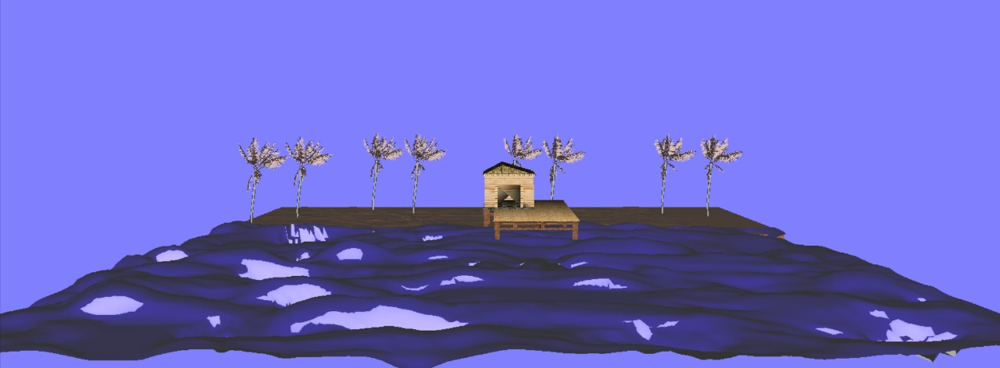

# Bienvenido-a-Filum.-OpenGL-MINIONS
Creacion escena en OpenGL de la voragine

### Imagen del resultado de subir los objetos y la casa texturizada

### Que hizo cada integrante del grupo:

- Emily: hizo lo de la texturizada de la casa y añadio la casa
- Jacob: hizo la inclusion de los otros dos objetos
- Santiago: hizo la inclusion del rio y optimizo el codigo en las funciones de abrir malla y abrir shader&nbsp;
